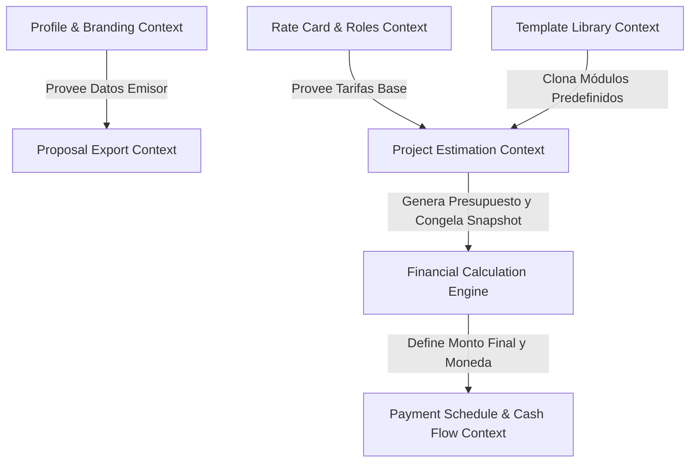

# 🏗️ Arquitectura Limpia y Domain-Driven Design (DDD) — Ciclic

## 1. Visión Estratégica de DDD

Para garantizar que Ciclic sea escalable, testeable y fácil de mantener, aplicamos **Domain-Driven Design (DDD)** táctico y estratégico, separando estrictamente la lógica de negocio de los detalles de infraestructura (Next.js, Supabase, etc.).

```
┌────────────────────────────────────────────────────────┐
│                   CAPA DE PRESENTACIÓN                  │
│       Next.js 15 (App Router, UI Components, Hooks)     │
└───────────────────────────┬────────────────────────────┘
                            │ (Usa DTOs e Invoca)
┌───────────────────────────▼────────────────────────────┐
│                    CAPA DE APLICACIÓN                  │
│   Use Cases / Interactors, DTOs, Comandos y Consultas   │
└───────────────────────────┬────────────────────────────┘
                            │ (Orquesta el Dominio)
┌───────────────────────────▼────────────────────────────┐
│                     CAPA DE DOMINIO                    │
│   Agregados, Entidades, Value Objects, Domain Events   │
│   (TypeScript Puro — 0 Dependencias de Framework)      │
└───────────────────────────▲────────────────────────────┘
                            │ (Implementa Interfaces / Inversión de Control)
┌───────────────────────────┴────────────────────────────┐
│                  CAPA DE INFRAESTRUCTURA               │
│  Supabase Repositories, Supabase Auth, PDF Adapters    │
└────────────────────────────────────────────────────────┘
```

---

## 2. Bounded Contexts (Contextos Delimitados)

Ciclic se estructura en 5 Bounded Contexts interconectados mediante contratos explícitos:



1. **Profile & Branding Context:** Gestión de datos del emisor, logotipo corporativo, términos legales y moneda base.
2. **Labor & Rate Cards Context:** Gestión de roles de desarrollo/diseño, tarifas horarias de costo/venta y monedas.
3. **Template Library Context:** Biblioteca de módulos y tareas reutilizables con horas base preestimadas.
4. **Project Estimation & WBS Context:** Desglose de proyectos en módulos, tareas, horas PERT y preservación inmutable de tarifas (*Snapshot*).
5. **Financial Calculation Context:** Motor de cálculo puro en cascada (contingencias, márgenes, impuestos, totales).
6. **Payment Schedule & Cash Flow Context:** Fraccionamiento en cuotas/hitos, algoritmo de distribución de centavos y control de cobros e ingresos.

---

## 3. Lenguaje Ubicuo (Ubiquitous Language)

- **Project (Proyecto):** Unidad central de estimación que agrupa módulos, costos y configuración financiera.
- **Module (Módulo):** Agrupación lógica de funcionalidades (ej. *Autenticación*, *Módulo de Pagos*).
- **Task (Tarea / Funcionalidad):** Ítem elemental de trabajo estimado en horas y asociado a un Rol.
- **RateCard (Tarifario):** Catálogo de tarifas horarias por perfil profesional.
- **Rate Snapshot (Snapshot de Tarifa):** Valor numérico inmutable de la tarifa horaria fijada al momento de la cotización para aislar el proyecto de futuros cambios en el tarifario global.
- **PERT Estimate:** Estimación ponderada de horas mediante fórmula estadística $\frac{O + 4M + P}{6}$.
- **Penny Allocation (Ajuste de Centavos):** Algoritmo que imputa la diferencia residual por redondeo fraccionario a la última cuota para garantizar coincidencia de suma al 100%.
- **Contingency (Contingencia / Riesgo):** Porcentaje de seguridad añadido sobre los costos directos para absorber imprevistos.
- **Profit Margin (Margen de Ganancia):** Porcentaje de utilidad sobre el costo operativo con contingencia.
- **Installment / Milestone (Cuota / Hito):** Fracción del pago total asociada a una fecha, porcentaje o entrega.
- **Cash Flow Record (Recibo de Pago):** Registro de una transacción de cobro realizada con fecha, método, monto y referencia.

---

## 4. Agregados, Entidades y Value Objects (Dominio Táctico)

### 4.1. Value Objects (Inmutables, comparables por valor)

Los Value Objects garantizan la consistencia y eliminan la obsesión por tipos primitivos (*primitive obsession*):

- **`Money`:**
  - Atributos: `amount: number`, `currency: CurrencyCode` (USD, EUR, ARS, etc.).
  - Comportamiento: `add(other)`, `subtract(other)`, `multiply(factor)`, `format(locale)`. Controla el redondeo a 2 decimales sin pérdida de precisión.
- **`EstimationHours`:**
  - Atributos: `optimistic: number`, `probable: number`, `pessimistic: number`.
  - Invariante: $optimistic \le probable \le pessimistic$.
  - Método: `calculateExpectedHours(): number`.
- **`Percentage`:**
  - Atributo: `value: number` (Rango: $0 \le value \le 100$).
  - Método: `applyTo(amount: number): number`.
- **`InstallmentSchedule`:**
  - Atributo: `installments: ReadonlyArray<Installment>`.
  - Invariante: $\sum \text{porcentajes} = 100\%$.
  - Método: `allocateResidualPenny(totalExpected: Money): Installment[]`.

### 4.2. Agregados y Entidades

#### Agregado 1: `Project` (Aggregate Root)
- **ID:** `ProjectId`
- **Atributos:** `userId`, `rateCardId`, `name`, `type` (Web, Mobile, Fullstack, API), `currency`, `contingencyRate: Percentage`, `profitMarginRate: Percentage`, `taxRate: Percentage`, `shareToken: string`, `isPublic: boolean`, `status: ProjectStatus`.
- **Entidades Hijas:**
  - `Module`: `id`, `name`, `description`, `sortOrder: number`, `tasks: FeatureTask[]`.
  - `FeatureTask`: `id`, `name`, `roleId`, `hourlyRateSnapshot: Money`, `hours: EstimationHours`, `complexityMultiplier: number`.
  - `ExternalCost`: `id`, `concept`, `amount: Money`, `isRecurringMonthly: boolean`, `durationMonths: number`.
- **Métodos de Negocio:**
  - `addModule(name, description): Module`
  - `addTaskToModule(moduleId, taskData, rateCard): void`
  - `freezeSnapshots(rateCard: RateCard): void`
  - `calculateLaborCost(): Money`
  - `calculateExternalCosts(): Money`
  - `calculateTotalBudget(): ProjectFinancialSummary`

#### Agregado 2: `RateCard` (Aggregate Root)
- **ID:** `RateCardId`
- **Atributos:** `userId`, `name`, `currency`, `isDefault: boolean`.
- **Entidades Hijas:**
  - `RoleRate`: `roleId`, `roleName`, `hourlyCost: Money`, `hourlyBillRate: Money`.
- **Métodos de Negocio:**
  - `addRole(roleName, hourlyCost, hourlyBillRate): void`
  - `getRateForRole(roleId): RoleRate`

#### Agregado 3: `PaymentPlan` (Aggregate Root)
- **ID:** `PaymentPlanId`
- **Atributos:** `projectId`, `totalAmount: Money`, `currency: string`.
- **Entidades Hijas:**
  - `Installment`: `id`, `sequenceNumber`, `title`, `percentage: Percentage`, `amount: Money`, `dueDate: Date`, `status: InstallmentStatus` (`PENDING`, `INVOICED`, `PARTIALLY_PAID`, `PAID`, `OVERDUE`, `CANCELLED`).
  - `PaymentReceipt`: `id`, `installmentId`, `paidAmount: Money`, `paidAt: Date`, `paymentMethod: string`, `referenceNotes: string`.
- **Métodos de Negocio:**
  - `generateEvenSplit(numberOfInstallments: number): void`
  - `generateStandardMilestones(advancePct, betaPct, releasePct): void`
  - `recordPayment(installmentId, amount, date, method, notes): void`
  - `getFinancialHealth(): CashFlowSummary`

#### Agregado 4: `UserProfile` (Aggregate Root)
- **ID:** `UserId`
- **Atributos:** `businessName: string`, `contactEmail: string`, `taxId: string`, `logoUrl?: string`, `defaultCurrency: string`, `defaultPaymentTerms: string`.
- **Métodos de Negocio:**
  - `updateBranding(businessName, logoUrl, contactEmail, taxId): void`
  - `updateDefaults(defaultCurrency, defaultPaymentTerms): void`

#### Agregado 5: `ModuleTemplate` (Aggregate Root)
- **ID:** `ModuleTemplateId`
- **Atributos:** `userId`, `name`, `description`, `isGlobal: boolean`.
- **Entidades Hijas:**
  - `TaskTemplate`: `id`, `title`, `defaultHours: EstimationHours`, `suggestedRoleName: string`.

---

## 5. Principios SOLID y DRY en Ciclic

- **Single Responsibility Principle (SRP):**
  - El agregador `Project` no calcula impuestos directamente ni interactúa con la base de datos; delega el cálculo matemático al `FinancialCalculationService` y la persistencia al `ProjectRepository`.
- **Open/Closed Principle (OCP):**
  - Se pueden añadir nuevos modelos de estimación implementando la interfaz `EstimationStrategy` sin alterar las entidades existentes.
- **Liskov Substitution Principle (LSP):**
  - Cualquier repositorio (ej. `SupabaseProjectRepository` o `InMemoryProjectRepository` para tests unitarios) cumple estrictamente con el contrato `IProjectRepository`.
- **Interface Segregation Principle (ISP):**
  - Interfaces específicas y compactas: `IReadOnlyProjectRepository`, `IProjectWriterRepository`, `IPdfExportService`, `IPublicProposalRepository`.
- **Dependency Inversion Principle (DIP):**
  - Los casos de uso dependen exclusivamente de interfaces de repositorio (Puertos), no de clientes directos de Supabase (Adaptadores).
- **DRY (Don't Repeat Yourself):**
  - Encapsulación de toda lógica de cálculo monetario, redondeos y ajuste de centavos en los Value Objects `Money` e `InstallmentSchedule`.
